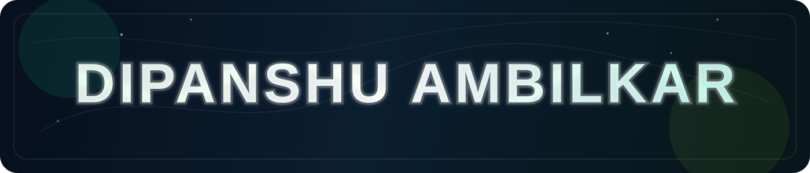

  

  <h2 align="center" style="margin: 0 0 10px; color: #eafdf0; font-size: 22px; letter-spacing: 1px;">Building with a clean stack, strong fundamentals, and polished delivery</h2>
  

    I work across Java, Python, Node.js, Express.js, React, and MERN, with experience in machine learning, web development, deployment, and hardware-based problem solving.
  

  <table width="100%" cellspacing="0" cellpadding="0" style="border-collapse: collapse;">
    <tr>
      <td valign="top" width="58%" style="padding-right: 16px;">
        

          <h3 style="margin: 0 0 12px; color: #ccfbf1; font-size: 16px;">About me</h3>
          <ul style="list-style-type: none; padding-left: 0; margin: 0; color: #d5dee8; line-height: 1.8; font-size: 14px;">
            <li style="margin-bottom: 6px;">Programming: <strong>Java, Python, Node.js, Express.js, REST APIs, DSA</strong>.</li>
            <li style="margin-bottom: 6px;">Web Development: <strong>HTML, CSS, JavaScript, React, MERN Stack</strong>.</li>
            <li style="margin-bottom: 6px;">Machine Learning: <strong>NumPy, Pandas, Matplotlib, Scikit-learn</strong>, with regression and tree-based models.</li>
            <li style="margin-bottom: 6px;">Databases: <strong>MongoDB</strong> and <strong>MySQL</strong>, plus practical backend integration.</li>
            <li style="margin-bottom: 6px;">Tools and deployment: <strong>Git, GitHub, Hoppscotch, Postman, Render, Vercel, Streamlit</strong>.</li>
            <li style="margin-bottom: 0;">Reach me at <a href="mailto:dipanshuambilker@gmail.com" style="color: #a3e635; text-decoration: none; font-weight: 700;">dipanshuambilker@gmail.com</a>.</li>
          </ul>
        

      </td>
      <td valign="top" width="42%">
        

          <h3 style="margin: 0 0 12px; color: #ccfbf1; font-size: 16px;">Connect</h3>
          

            
            
            
            
            
          

        

      </td>
    </tr>
  </table>

  <h3 style="font-size: 14px; letter-spacing: 1px; color: #a3e635; margin: 0 0 14px;">Contribution Calendar Metrics</h3>
  
Half-year and full-year activity generated with your metrics workflow.

  

    
  

  

    
  

  <h3 style="font-size: 14px; letter-spacing: 1px; color: #a3e635; margin: 0 0 12px;">Academic Projects</h3>
  

    

      <strong style="color: #ffffff;">WanderLust</strong> | MERN Stack
      
Full-stack housing listing application built with Node.js, Express.js, MongoDB, modular MVC architecture, Passport.js authentication, role-based access control, Cloudinary image handling, and a Vercel deployment.

    

    

      <strong style="color: #ffffff;">DWLR Project</strong> | Team Leader
      
Led the design and development of a Digital Water Level Recorder system to solve fragmented data and centralized monitoring issues, and won 1st prize at the institutional level.

    

    

      <strong style="color: #ffffff;">Freelancer Platform</strong>
      
A scalable web platform for user registration, assignment submission, and bidding workflows for completing work efficiently.

    

    

      <strong style="color: #ffffff;">IoT Hardware Model</strong> and <strong style="color: #ffffff;">Recyclable Back Support Prototype</strong>
      
Built an Arduino-based vehicle detection model for automatic headlight intensity control and a recyclable 3D-printed CATIA prototype focused on sustainability.

    

  

  <h3 style="font-size: 14px; letter-spacing: 1px; color: #a3e635; margin: 0 0 12px;">Languages and Tools</h3>
  

    
    
    
    
    
    
    
    
    
    
    
    
    
    
    
  

<!--

&nbsp;

-->
<!-- 

 -->

